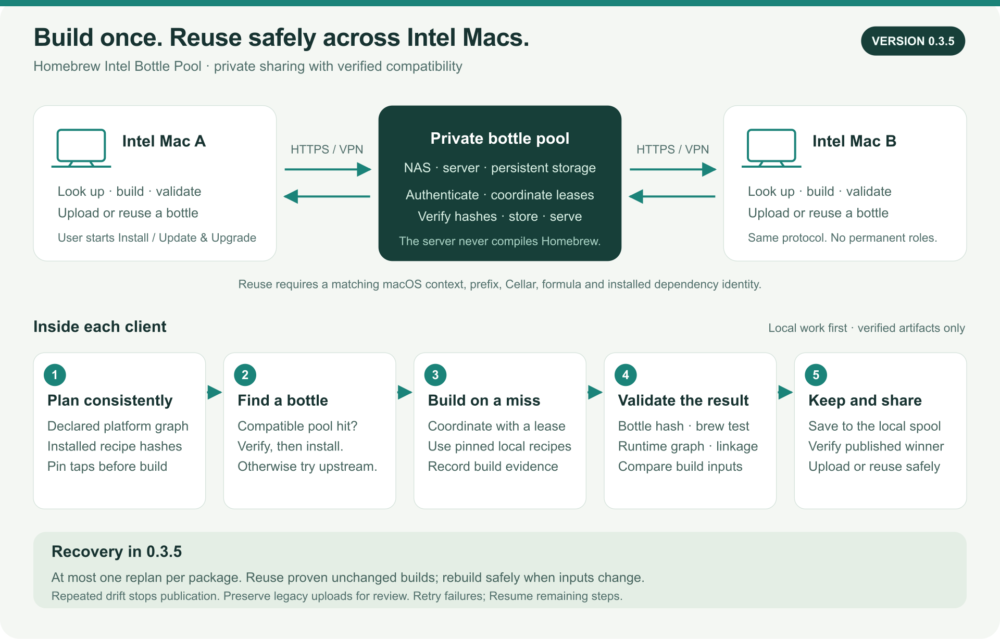

# Homebrew Intel Bottle Pool

**Version 0.3.6 preview · License revision 1 · Intel macOS client**

> **Copyright © 2026 StefanAlMare. All rights reserved.**
> **Personal, non-commercial use of the official unmodified app/server is permitted.**
> **Commercial/business use, source-code reuse, modification, integration into other projects, redistribution and derivative works require StefanAlMare's PRIOR EXPLICIT WRITTEN PERMISSION.**
> Public source is not an open-source grant. Attribution or a fork is not consent.
> See the [complete license, version 1.1](LICENSE).

> Build once. Reuse safely across compatible Intel Macs.

Trusted Intel Macs share software they have already built or downloaded. A Mac finds a compatible bottle, or builds and validates one locally, then shares it through your private pool. The server stores artifacts; it never compiles Homebrew.

Created and maintained by **StefanAlMare**, developed together with **ChatGPT by OpenAI**. Independent of Homebrew; not affiliated with or endorsed by Homebrew.

## Download the current v0.3.6 preview

**The complete v0.3.6 app is available now** in the License 1.1 edition. “License 1.1 edition” describes the permissions bundled with the app; it is **not** a license-only download.

- **[Download v0.3.6 for Intel macOS (standard DMG)](https://github.com/StefanAlMare/Homebrew-Intel-Bottle-Pool/releases/download/v0.3.6-license.1/Homebrew-Intel-Bottle-Pool-v0.3.6-license.1-standard.dmg)**
- [Alternative application ZIP](https://github.com/StefanAlMare/Homebrew-Intel-Bottle-Pool/releases/download/v0.3.6-license.1/Homebrew-Intel-Bottle-Pool-v0.3.6-license.1-standard.zip) · [Source archive](https://github.com/StefanAlMare/Homebrew-Intel-Bottle-Pool/releases/download/v0.3.6-license.1/Homebrew-Intel-Bottle-Pool-v0.3.6-license.1-standard-source.zip) · [SHA-256 checksums](https://github.com/StefanAlMare/Homebrew-Intel-Bottle-Pool/releases/download/v0.3.6-license.1/SHA256SUMS.txt)
- [Release description and supporting files](https://github.com/StefanAlMare/Homebrew-Intel-Bottle-Pool/releases/tag/v0.3.6-license.1)

**Why GitHub may display v0.3.5 as “Latest”:** v0.3.6 and its License 1.1 edition are deliberately marked **pre-release** until physical acceptance tests are complete. v0.3.5 remains the latest *stable* release; this does not mean the v0.3.6 DMG or ZIP is missing. Do not use a generic `/releases/latest` link to find the preview. Keep the older release available for rollback.

## Start here

| What do you need? | Your next step |
| --- | --- |
| Install or upgrade the app | [Download v0.3.6 — License 1.1 edition](https://github.com/StefanAlMare/Homebrew-Intel-Bottle-Pool/releases/tag/v0.3.6-license.1), then follow [Install / Upgrade](#install--upgrade). |
| Create a private pool | Follow [Server setup](SERVER_SETUP.md), then enroll Macs with [Installation](INSTALLATION.md). |
| Understand the buttons | Read the [User guide](USER_GUIDE.md): Pause, Resume, imports and recovery. |
| Use an older Intel Mac | Read [compatibility](#compatibility-and-older-intel-macs) before sharing bottles. |
| Audit the release | Read [changes](RELEASE_NOTES.md), [validation](VALIDATION.md), [parity](PARITY_REPORT.md) and [license](LICENSE). |

**Release status:** v0.3.6 is a locally built, Developer ID signed, Apple-notarized **preview**, not a stable-release claim. Local regression and GUI checks passed. Physical HP, MacBook Pro 2012 and Core 2 Quad Q9300 tests remain pending. The **License 1.1 edition** keeps the same runtime and updates permission terms/distribution notices. Historical [v0.3.5](https://github.com/StefanAlMare/Homebrew-Intel-Bottle-Pool/releases/tag/v0.3.5) remains available under its accompanying license; old tags and valid prior grants are not rewritten.

## How it works



[Editable diagram](docs/assets/how-it-works.svg)

1. **Plan consistently:** resolve the platform dependency graph; identify installed dependencies by their embedded recipes.
2. **Find a compatible bottle:** verify pool identity/integrity, or try upstream.
3. **Build only on a miss:** coordinate with a lease and pinned local recipes.
4. **Validate:** SHA-256, context, dependencies, formula tests and linkage.
5. **Keep and share:** durable local spool, atomic publication and verified server result. Offline output stays queued.

Both Macs can build and consume. There are no permanent roles, silent upgrades or assumptions that every x86_64 CPU supports the same instructions.

## New in 0.3.6

| Feature | What it does | Important boundary |
| --- | --- | --- |
| **Pause Safely / Resume** | Persistent checkpoint after the current formula reaches a safe boundary; revalidation after restart. | Wait for **Safely Paused** before quitting. |
| **Stop Now** | Controlled cancellation of worker and associated children, retaining the queue. | No promise to resume a compiler's internal progress. |
| **Sleep prevention** | Keeps the Mac awake during active managed work. | Does not override manual sleep or shutdown. |
| **Scan / Review / Import Existing Bottles** | Finds archives and installed candidates; verifies identity, SHA-256, provenance, dependencies and CPU context. | An installed keg alone is not a bottle. |
| **Auto-import verified bottles** | Optional extra scan/import after a fully completed Install/Upgrade. | **Off by default**; no import after failed/incomplete work. |
| **Capture Installed Formula** | Bottles a copied, genuinely bottle-built keg and validates it in an isolated prefix. | Requires reviewed proof; never patches receipts or publishes automatically. |
| **Compatibility Options** | Explains CPU restrictions and reviewed alternatives, including versioned formulae and approved Core 2 builds. | No automatic downgrade or Git branch switch. |
| **Standard DMG upgrade** | Applications shortcut, normal app identity and existing settings paths. | Separate .test settings are not migrated automatically. |

v0.3.5 provenance, bounded recovery, nested-dependency attribution, Retry, Repair and Maintenance Console safeguards remain. [Full changelog](CHANGELOG.md).

## Install / Upgrade

Requirements: Intel x86_64, **macOS 12+ for the GUI**, Homebrew, Python 3.9+, and Command Line Tools for source builds. The app does not silently install prerequisites. Each formula's supported OS/CPU still applies.

1. Download the **standard DMG** and **SHA256SUMS.txt** from [v0.3.6 — License 1.1 edition](https://github.com/StefanAlMare/Homebrew-Intel-Bottle-Pool/releases/tag/v0.3.6-license.1).
2. Calculate the downloaded DMG's hash and compare the **entire digest** with its matching line in SHA256SUMS:

   ```sh
   shasum -a 256 Homebrew-Intel-Bottle-Pool-v0.3.6-license.1-standard.dmg
   ```

   A full `shasum -c` check requires downloading every listed asset.
3. Finish work and Quit before replacing an older app. In v0.3.6 use **Pause Safely**, wait for **Safely Paused**, then Quit. Older versions without this button must finish their current work. Keep the old binary for rollback.
4. Open the DMG and drag **Homebrew Pool.app** onto **Applications**. Choose Replace only when you intend to upgrade; nothing replaces the app automatically.
5. Launch **/Applications/Homebrew Pool.app**, not the app on the mounted DMG.

**Existing users:** the standard package reuses `~/.config/intel-bottle-pool/config.json` (or XDG location), token/CA references, custom `state_dir`, queue and spool. Do not delete `job.json`, reset state or redeploy the server. Review, then explicitly Resume/Retry.

**New users:** enter the private HTTPS server URL and token/token file in Setup; select a CA only if needed. Choose Test Connection, then Save & Finish. [Full instructions](INSTALLATION.md). Start at Login starts the agent, not automatic upgrades.

## Set up the server

Follow [SERVER_SETUP.md](SERVER_SETUP.md) for storage, credentials, container/direct Python, HTTPS, TrueNAS mapping, backups and acceptance checks.

Basic direct command, run **on the server from the official source directory**:

```sh
python3 -m pool.server \
  --root /srv/homebrew-pool \
  --bind 127.0.0.1 --port 8765 \
  --token-file /run/secrets/pool.token
```

Put an HTTPS reverse proxy in front of the loopback service. Example URL: `https://pool.example.internal`. These are placeholders. Never expose HTTP with a bearer token to the Internet. One service owns the data root; do not use SMB/NFS as its active root.

**Existing server?** Schema 1 is preserved. Upgrading the client does not require changing TrueNAS, deleting artifacts or rotating credentials.

## What uploads automatically?

| Action | Behavior |
| --- | --- |
| App-managed Install / Update & Upgrade | Validated obtained/built artifacts are published automatically; offline output stays in the durable spool. |
| Sync now | Retries queued publications, not an unreviewed disk import. |
| Import to Pool | Imports verified existing candidates; identical artifacts are not uploaded again. |
| Auto-import **ON** | Extra scan/import after a completed Install/Upgrade, with no errors or remaining steps. |
| Capture Installed Formula | Creates a reviewed candidate; **does not publish automatically**. |
| Direct Homebrew installation outside the app | No automatic upload; Scan/Review/Capture may be needed. Missing evidence stays at review. |

A source-built Node 26.11.0 installation without a confirmed bottle is not advertised as a reusable bottle.

## Compatibility and older Intel Macs

Reuse checks macOS bottle tag, architecture, prefix/Cellar, exact recipe, version/revision, dependencies, context and CPU requirements. Incompatible or unverifiable artifacts are refused.

**Q9300 lacks SSE4.2 and AVX.** Bottles requiring either cannot be distributed to it. x86_64 alone is insufficient; producer proof is attestation, not an audit of every binary instruction.

**Compatibility Options…** can suggest a supported versioned formula (for example a reviewed Python version), a separately approved Core 2 source build, or a legacy patch for expert review. A versioned formula is not a Git branch. No silent downgrade, dependency substitution, fake receipt or guarantee that unsupported software will compile. [Evidence requirements](IMPORT_PROVENANCE.md).

## Daily operation and recovery

**Pause Safely** finishes the current formula and checkpoints. While waiting: **Pause requested — finishing current formula**. **Resume…** rechecks saved progress after restart. **Retry Failed…** handles failures without losing other pending steps.

**Stop Now** cancels immediately; it is not safe pause. Repair, Maintenance Console and Open logs remain available. Queue cancellation is explicit, not a routine UI refresh. See [USER_GUIDE.md](USER_GUIDE.md).

## Trust, development and license

A pool is for trusted peers. Hash/context checks do not make a malicious producer safe. The bearer token is shared access, not per-user permissions. Protect tokens, TLS keys, config and backups. Mutable `latest` / `no_check` Casks remain upstream-only.

[Validation](VALIDATION.md) states what was run and what was not. [Releasing](RELEASING.md) documents local-only builds and separately authorized uploads. No GitHub Actions, CI or hosted builds.

## License and source-code permission

**Copyright © 2026 StefanAlMare. All rights reserved. Not open source; not MIT.**

| Use | Permission |
| --- | --- |
| Run the official unmodified app/server for personal, non-commercial use | Allowed without charge under LICENSE 1.1; ordinary documented configuration and private backups are allowed. |
| Any commercial, professional or business use, including internal business operation | **Prior explicit written permission from StefanAlMare required.** |
| Reuse or copy code into another project; integrate, modify or create derivative work | **Prior explicit written permission required, even for non-commercial projects.** |
| Repackage, redistribute, mirror, sublicense, sell or host for third parties | **Prior explicit written permission required.** |

Contact [StefanAlMare](https://github.com/StefanAlMare) with the exact intended use. Giving credit, opening an issue, a fork or silence is not authorization. Do not publish secrets or private commercial details in an issue.

GitHub's limited public-repository viewing/forking rights remain as required by its Terms; they do not grant general code reuse. Third-party Homebrew packages retain their own licenses. Earlier distributions retain the license that accompanied them; version 1.1 does not retroactively revoke valid prior grants. See [LICENSE](LICENSE) for the complete controlling terms.

Created and directed by **StefanAlMare**, developed with **ChatGPT by OpenAI** for design, implementation, testing, documentation and release preparation.
